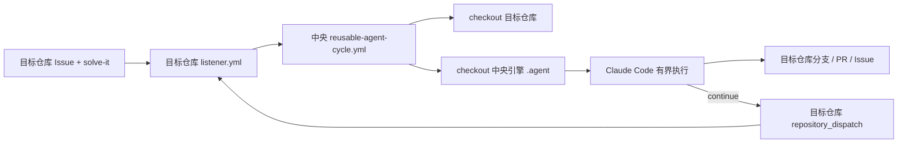

# 跨仓库 Agent Cycle 改造计划

## 1. 目标

将当前只能在 `dustPyrotechnic/agent-cycle-test` 内运行的 Agent Cycle 改造成中央可复用引擎。改造后，每个目标仓库只需要安装一个小型监听工作流，并配置模型密钥，即可通过该仓库的 `solve-it` Issue 启动代理。

本次改造不追求“新仓库零配置自动接入”。完全不向目标仓库添加工作流需要 GitHub App 和长期运行的 webhook 服务，应作为后续独立项目处理。

## 2. 当前实现

当前 `.github/workflows/agent-cycle.yml` 同时承担以下职责：

1. 监听本仓库的 Issue、手动运行和 `repository_dispatch`。
2. checkout 本仓库。
3. 从本仓库读取 `.agent/` 包装脚本。
4. 使用本仓库的 `GITHUB_TOKEN`、模型 Secrets 和仓库设置。
5. 在本仓库创建 `agent/issue-<number>` 分支、PR、Issue 评论和接力事件。

GitHub Actions 事件和 `GITHUB_TOKEN` 都属于当前仓库，因此这个工作流不能直接监听或修改其他仓库。

## 3. 目标架构



### 中央仓库职责

- 保存可复用工作流、包装脚本、统一提示词和版本约束。
- 校验输入并执行一轮有界代理任务。
- 使用调用仓库提供的 `GITHUB_TOKEN` 和模型 Secrets。
- 不直接持有目标仓库的长期 PAT。

### 目标仓库职责

- 监听本仓库的 Issue、接力事件和手动触发。
- 声明 `contents: write`、`issues: write`、`pull-requests: write`。
- 显式传递 Issue 编号、提供商、轮数上限和模型 Secrets。
- 保存自己的 Agent 状态、任务分支、PR 和模块文档。

## 4. 关键设计决定

### 4.1 使用调用仓库上下文

Reusable workflow 中的 `github` 上下文和 `GITHUB_TOKEN` 属于调用仓库。中央工作流中的所有目标仓库操作必须继续使用：

```text
GITHUB_REPOSITORY
secrets.GITHUB_TOKEN
```

不得使用中央仓库名作为目标仓库操作地址。

### 4.2 分离目标代码与中央引擎

Reusable workflow 的文件不会自动出现在 runner 工作目录中。工作流必须进行两次 checkout：

1. 目标仓库 checkout 到默认工作目录。
2. 中央仓库 checkout 到 `$RUNNER_TEMP/agent-engine` 或独立子目录。

包装脚本从中央引擎快照执行，但 `git` 和 Claude Code 的工作目录必须是目标仓库。

### 4.3 接力必须回到目标仓库

`finalize-round.sh` 继续向 `${GITHUB_REPOSITORY}` 发送 `agent-relay`。目标仓库监听器必须声明：

```yaml
on:
  repository_dispatch:
    types: [agent-relay]
```

接力后，监听器再次调用中央 reusable workflow，并传递原 Issue 编号、提供商和轮数上限。

### 4.4 Secrets 由目标仓库提供

个人账号下没有可跨所有仓库共享的用户级 Actions secrets。每个目标仓库需要配置：

- `DEEPSEEK_API_KEY`
- `MIMO_API_KEY`，可选

监听器应显式传递 Secrets，不依赖 `secrets: inherit`：

```yaml
secrets:
  DEEPSEEK_API_KEY: ${{ secrets.DEEPSEEK_API_KEY }}
  MIMO_API_KEY: ${{ secrets.MIMO_API_KEY }}
```

如果未来把仓库迁入同一 GitHub Organization，可以使用 Organization Actions secrets 统一授权。

### 4.5 目标仓库规则优先

中央引擎提供通用执行边界。目标仓库可通过自己的以下文件提供项目规则：

- `CLAUDE.md`
- `AGENTS.md`
- 根级与模块级 `memory.md`

目标仓库没有这些文件时，代理仍使用中央提示词执行，但不应自动复制中央仓库的项目说明到目标仓库。

### 4.6 版本必须固定

目标仓库监听器调用中央工作流时，生产环境应固定到 release tag 或 commit SHA：

```yaml
uses: dustPyrotechnic/agent-cycle-test/.github/workflows/reusable-agent-cycle.yml@v1
```

开发测试阶段可以临时使用 `@main`。完成跨仓库验收后创建 `v1`，避免中央仓库的未验证改动同时影响所有目标仓库。

## 5. 文件级改造

### 5.1 新增中央可复用工作流

新增：

```text
.github/workflows/reusable-agent-cycle.yml
```

使用 `workflow_call` 声明：

```yaml
on:
  workflow_call:
    inputs:
      issue_number:
        required: true
        type: string
      provider:
        required: false
        default: deepseek
        type: string
      max_rounds:
        required: false
        default: "5"
        type: string
      trusted_associations:
        required: false
        default: OWNER
        type: string
    secrets:
      DEEPSEEK_API_KEY:
        required: false
      MIMO_API_KEY:
        required: false
```

工作流步骤：

1. checkout 调用仓库。
2. checkout 中央仓库到临时引擎目录。
3. 从中央引擎目录快照 `.agent/`。
4. 安装固定版本 Claude Code。
5. 在目标仓库工作目录执行 prepare、run、finalize。

### 5.2 新增目标仓库监听器模板

新增：

```text
templates/agent-cycle-listener.yml
templates/memory.md
```

监听器模板负责：

- `issues:labeled`
- `repository_dispatch:agent-relay`
- `workflow_dispatch`
- 调用中央 reusable workflow
- 显式声明权限和传递 Secrets

建议模板结构：

```yaml
name: Agent Cycle

on:
  issues:
    types: [labeled]
  repository_dispatch:
    types: [agent-relay]
  workflow_dispatch:
    inputs:
      issue_number:
        required: true
        type: string

permissions:
  contents: write
  issues: write
  pull-requests: write

jobs:
  cycle:
    if: >-
      github.event_name == 'repository_dispatch' ||
      github.event_name == 'workflow_dispatch' ||
      (github.event_name == 'issues' && github.event.label.name == 'solve-it')
    uses: dustPyrotechnic/agent-cycle-test/.github/workflows/reusable-agent-cycle.yml@v1
    with:
      issue_number: ${{ github.event.issue.number || github.event.client_payload.issue_number || inputs.issue_number }}
      provider: ${{ github.event.client_payload.provider || 'deepseek' }}
      max_rounds: ${{ github.event.client_payload.max_rounds || '5' }}
    secrets:
      DEEPSEEK_API_KEY: ${{ secrets.DEEPSEEK_API_KEY }}
      MIMO_API_KEY: ${{ secrets.MIMO_API_KEY }}
```

### 5.3 保留中央仓库自测试入口

当前 `.github/workflows/agent-cycle.yml` 不应直接删除。将它简化为中央仓库自己的监听器，并让它调用同一个 reusable workflow。这样中央仓库和其他目标仓库走同一条生产路径。

### 5.4 调整包装脚本

需要检查并改造：

- `.agent/scripts/prepare-round.sh`
- `.agent/scripts/run-round.sh`
- `.agent/scripts/finalize-round.sh`
- `.agent/scripts/validate.sh`

具体要求：

- 支持显式 `ENGINE_ROOT` 和 `TARGET_ROOT`。
- 所有 Git 操作在 `TARGET_ROOT` 下执行。
- 所有可信脚本和提示词从 `ENGINE_ROOT` 读取。
- 目标仓库没有中央仓库专属 memory 文件时，`validate.sh` 不得错误阻止任务。
- 目标仓库 Agent 改坏 `.github/workflows` 或根级说明时，finalize 仍执行中央引擎快照。
- 接力 payload 保留 `issue_number`、`provider` 和 `max_rounds`。

### 5.5 分离两类验证器

当前 `validate.sh` 验证的是中央引擎仓库结构。跨仓库后需要分离：

- `validate-engine.sh`：验证中央引擎自身完整性、同步文档和模板。
- `validate-target.sh`：在目标仓库存在项目验证命令时运行；否则只做通用安全检查。

中央引擎验证失败应阻止发布。目标仓库没有中央引擎目录结构不应被视为失败。

### 5.6 更新文档和 memory

同步更新：

- `README.md`
- `CLAUDE.md`
- `AGENTS.md`
- `memory.md`
- `.agent/memory.md`
- `.agent/scripts/memory.md`
- `.github/memory.md`
- `.github/workflows/memory.md`
- `templates/memory.md`

根级 `CLAUDE.md` 与 `AGENTS.md` 必须继续保持 byte-for-byte 相同。

## 6. 实施阶段

### 阶段 A：抽取但不改变行为

1. 新增 `reusable-agent-cycle.yml`。
2. 让中央仓库现有监听器调用 reusable workflow。
3. 保持中央仓库 Issue #1 类似的完整链路可用。

退出条件：

- 中央仓库回归测试全部通过。
- 运行仍能创建任务分支、PR 和 `agent-done` 标签。

### 阶段 B：接入测试目标仓库

1. 创建一个专用私有测试仓库。
2. 安装监听器模板。
3. 配置 Actions secrets、`solve-it` 标签和 PR 权限。
4. 执行跨仓库最小验证 Issue。

退出条件：

- 中央引擎代码未复制到目标仓库。
- 所有状态、分支、PR 和 Issue 评论均只出现在目标仓库。

### 阶段 C：验证接力和失败恢复

1. 执行要求至少两轮的 Issue。
2. 验证 `repository_dispatch` 返回目标仓库。
3. 验证轮数上限、blocked、缺失 Secret 和 PR 权限关闭等失败路径。

退出条件：

- 不存在无限循环。
- 所有失败都能留下可操作的 Issue 状态和日志。

### 阶段 D：发布和批量接入

1. 创建 `v1` release tag。
2. 将监听器中的 `@main` 替换为 `@v1`。
3. 使用脚本或手动方式向其他仓库添加监听器。
4. 每个仓库完成一次最小验收。

退出条件：

- 每个接入仓库有独立验收记录。
- 中央引擎升级有明确的版本和回滚方法。

## 7. 权限与配置清单

每个目标仓库必须具备：

- GitHub Actions 已启用。
- `Allow GitHub Actions to create and approve pull requests` 已启用。
- `solve-it` 标签已创建。
- `DEEPSEEK_API_KEY` Actions secret 已配置。
- 可选 `MIMO_API_KEY` Actions secret 已配置。
- 中央 reusable workflow 对该仓库可访问。
- 监听器声明以下权限：
  - `contents: write`
  - `issues: write`
  - `pull-requests: write`

中央仓库如果保持 private，必须验证个人账号下其他 private 仓库是否能访问该 reusable workflow。注意：即便迁入同一 Organization 并开放 reusable workflow 访问，调用仓库的 `GITHUB_TOKEN` 仍只对调用仓库有 `contents:read`，无法 checkout 私有引擎仓库的 `.agent` 内容。因此 private 引擎必须从下列方案中选择：

1. 将中央引擎仓库设为 public，但继续只在目标仓库存放模型 Secrets。引擎 checkout 回退到默认 `github.token`，无需额外配置。
2. 保持 private，由每个目标仓库配置一个跨仓库 PAT 或 GitHub App token，并通过 reusable workflow 的可选 `engine_token` secret 传入；仅用于引擎 checkout，不参与目标仓库的 git 操作。迁入同一 Organization 只解决 reusable workflow 的访问授权，不能替代该 token。

## 8. 风险与缓解

| 风险 | 后果 | 缓解 |
| --- | --- | --- |
| reusable workflow 未获得目标仓库写权限 | 无法推送或创建 PR | 调用工作流显式声明 permissions，并执行权限失败测试 |
| 中央脚本未 checkout | 工作流找不到 `.agent` | 目标代码与引擎代码双 checkout |
| 接力发送到中央仓库 | 下一轮修改错误仓库或不触发 | 所有 dispatch 使用调用上下文的 `GITHUB_REPOSITORY` |
| 目标仓库缺少中央 memory 结构 | 通用验证错误失败 | 分离 engine 和 target validator |
| 中央 `main` 改动破坏所有仓库 | 批量故障 | 生产调用固定 `v1` 或 commit SHA |
| 每仓库 Secrets 配置遗漏 | 模型步骤失败 | 接入清单和缺失 Secret 测试 |
| 私有中央仓库不可访问 | reusable workflow 无法启动 | 在阶段 B 先验证访问策略，必要时 public 或迁移 Organization |
| 目标仓库 Issue 提示注入 | 非预期修改或泄漏尝试 | 保留 clean env、可信作者、快照包装脚本和 PR 审核出口 |

## 9. 回滚方案

出现跨仓库故障时：

1. 从目标仓库删除或禁用监听器工作流。
2. 移除未完成 Issue 的 `solve-it` 标签。
3. 关闭未审查的 Agent PR。
4. 删除对应 `agent/issue-<number>` 分支。
5. 将监听器固定回上一稳定 release tag。

中央仓库应保留当前单仓库工作流的最后稳定 tag，以便在 reusable workflow 改造失败时恢复。

## 10. 完成定义

只有满足以下条件才视为改造完成：

- 中央仓库自身通过 reusable workflow 完成回归。
- 至少一个独立目标仓库完成单轮和多轮任务。
- 目标仓库的代码、状态、Issue、分支和 PR 均未写入中央仓库。
- 缺失 Secret、无 PR 权限、非可信作者、轮数上限和 blocked 路径均验证通过。
- 生产监听器固定到稳定 tag 或 commit SHA。
- `CROSS_REPO_TEST_PLAN.md` 中所有 P0 测试通过。
